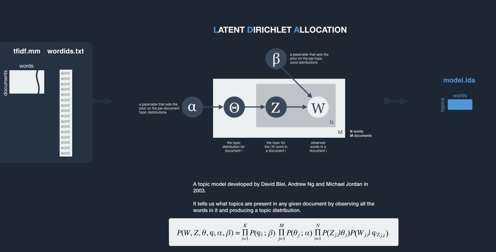
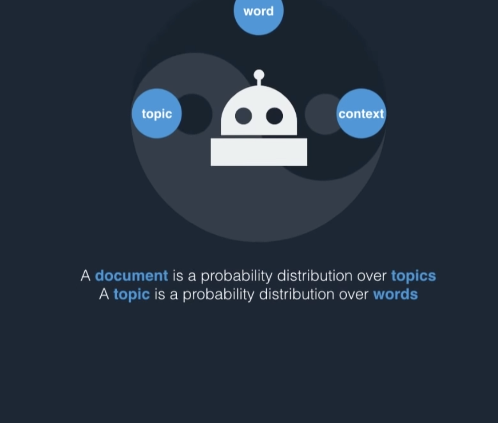

# Latent Dirichlet Allocation (LDA)

* Bag of words model
* Generative model
* probabilistic model/distribution 
* collection of documents is a mixture of latent topics 
    * Presumably, each document adds to the frequency distribution for different topics
    * Finally, we get a set of topics with levels of distribution of words
* Each topic is determined as a distribution made by word frequency 

* It is like *clustering* 

* Latent means (hidden). We don't know the topics, but we know that each topic is dominated by the *same* set of words
  occurring repeatedly. This is equivalent to having a hidden layer in NN, the only observables being the words and
  documents.

* Dirichlet distribution is a multivariate generalization of beta-distribution
    * beta-distribution is used for proportion and percentage distributions.
    * beta distribution is controlled by 2 parameters (alpha, beta). Note: E(beta) = alpha/(alpha+beta)
    * In multivariate context, alpha and beta would be vectors instead of scalars
    * These are the hyper-parameters of the model

* alpha in this context is simply the per document distribution of topic = proportion of each topic in this document
    * note that the document can cover multiple topics and thus can contribute to any number of topics ...
    * high alpha means that every document covers all topics equally
    * low alpha means that some topics are disproportionately covered. (We need this for contact lenses)
    * i.e. low alpha value means a document is *represented* only be few of the topics
 
 * beta is simply per topic word distribution (consider the whole bag of words, find how many words are distributed
   across given number of topics. Note that the same word can appear in multiple topics!!)
    * high beta means each topic contains most of the words
    * low beta means that each topic is made of just a few words (we need low beta in contacts lens project to characterize the topics with only a few strong words?) 

 * High alpha will make documents make more similar to each other
 * High beta will make topics more similar to each other

 * How many topics to choose ?
    * Experimentation

 * Every document consists of words, and given each topic, determines the word distribution for that topic and thus
   determines the topic distribution. Every document is thus a probability distribution sample for *every* topic
   i.e. every document determines topic distribution corresponding to that document

 * A topic is simply a probability distribution determined by words. i.e. every topic has a word distribution that
   determines the topic  
 

 * How to measure distance between two probability distributions ?
    * Use Jensen-Shannon metric

 * Topic modeling can be considered as determining some probability distribution of topics in a corpus. So if we want to
   compare two corpus and see if they are similar, we can do LDA on both and compare them using Jensen-Shannon metric 

*  

  
#### General LDA philosophy for topic modeling  

* 

